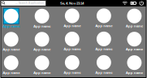

# Tharsis
A Vulkan and Rust based controller UI for GNU/Linux.  
It's planed to run as a standalone application atop gamescope to provide a more general controller interface as like
the Steam Deck UI which is tailored towards Steam.  

This is primarily a resaerch project to explore possibilities to mimik a more general purpose controller friendly user interaface. 
This is **not** a full featured desktop environment, window manager or Wayland compositor and not planed to be one. This is what gamescope already provides and will be used for.  

By keepin any window managing out of this project it should also be able to run outside of a gamescope session.

[](https://github.com/Z-Ray-Entertainment/tharsis/actions/workflows/rust.yml)

## Concept


## Requirements
- rustup
- gcc-c++
- ninja
- CMake
- vulkan-devel
- vulkan-tools
- fontconfig-devel

### openSUSE
`sudo zypper in cmake ninja vulkan-devel vulkan-tools gcc-c++ fontconfig-devel`

## Compile and run
`cargo r`

# Distrobox
If you want to develop tharis on an mmutable distribution you may want to use a distrobox container.  
Or if you do not want to litter your host system and user home directory with development files only required for developing tharis

## nvidia
Distrobox does not setup the nvidia vulkan host driver correctly:  
```
distrobox-create -i tumbleweed:latest --volume /etc/vulkan:/etc/vulkan --nvidia --name tharsis_dev --home ~/distrobox/home_develop --additional-packages "git opi cmake ninja vulkan-devel vulkan-tools gcc-c++ fontconfig-devel scout-command-not-found bash-completion"
distrobox-enter tharsis_dev
cd /usr/lib64
sudo ln -s ./libnvidia-vulkan-producer.so.xxx.xx.xx ./libnvidia-vulkan-producer.so
```

## AMD / Intel
`distrobox-create -i tumbleweed:latest --name tharsis_dev --home ~/distrobox/home_develop --additional-packages "git opi cmake ninja vulkan-devel vulkan-tools gcc-c++ fontconfig-devel scout-command-not-found bash-completion"`
